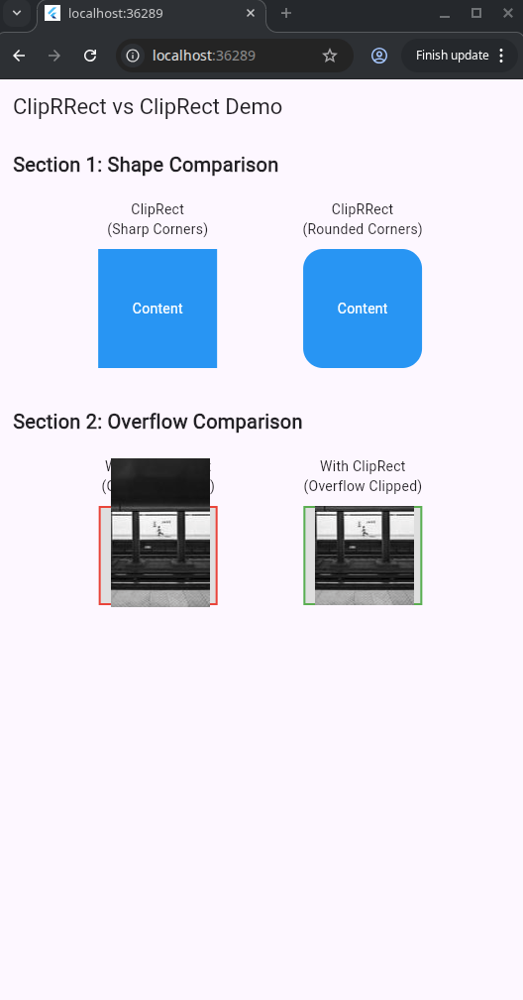

# ClipRect vs ClipRRect – Flutter Demo

This project demonstrates the difference between ClipRect (sharp rectangle) and ClipRRect (rounded rectangle) in Flutter.

---

## What It Shows

1. Shape Comparison  
- ClipRect → sharp corners  
- ClipRRect → rounded corners (`borderRadius`)

2. Overflow Comparison  
- ClipRect prevents content from overflowing  
- ClipRRect clips overflow with rounded corners

---

## Real-World Use Cases

**ClipRRect:** profile pictures, cards, buttons, product images  
**ClipRect:** prevent overflow, crop content, performance-friendly

```dart
// ClipRRect example
ClipRRect(
  borderRadius: BorderRadius.circular(20),
  child: Image.asset("profile.jpg"),
)

// ClipRect example
ClipRect(
  child: Image.asset("banner.jpg"),
)
```
## Widget Properties

- **child**: the widget being clipped
- **borderRadius** (ClipRRect only): controls corner roundness
- **clipBehavior**: controls how clipping is applied (e.g., Clip.none, Clip.antiAlias)

---

## How to Run

```bash
git clone https://github.com/Tapiwanashe6/clipRect.git
cd clipRect
flutter pub get
flutter run
```


## Author

Tapiwanashe Marufu  
Flutter Learning Demo Project
